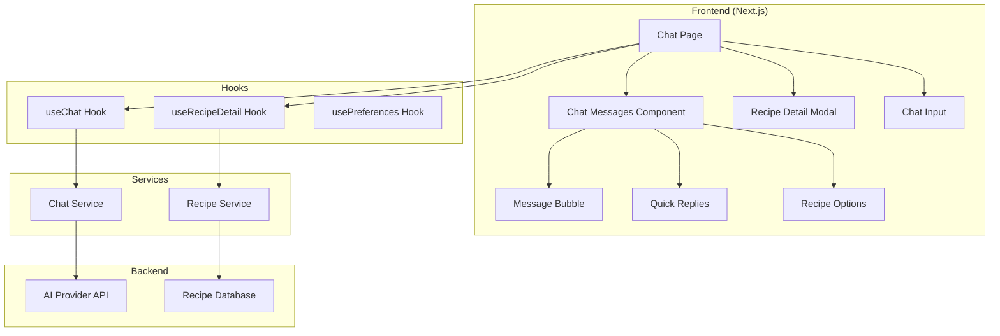

# AI Chat Feature Design Document

## Overview

This document outlines the technical design for the AI-powered chat interface in KitchenPal. The feature enables users to have conversational interactions with an AI assistant for recipe suggestions, cooking guidance, and ingredient-based meal planning. The design includes a chat interface with message bubbles, quick replies, and a detailed recipe view presented as a bottom sheet modal.

## Architecture



## Components and Interfaces

### Chat Page Component
```typescript
interface ChatPageProps {
  // No props - uses hooks for state
}

// Main chat page at /chat route
// Manages overall chat state and layout
```

### Message Types
```typescript
type MessageRole = 'user' | 'assistant' | 'system'

interface ChatMessage {
  id: string
  role: MessageRole
  content: string
  timestamp: Date
  quickReplies?: QuickReply[]
  recipeOptions?: RecipeOption[]
  recipeCard?: RecipeCard
}

interface QuickReply {
  id: string
  label: string
  value: string
}

interface RecipeOption {
  id: string
  name: string
  selected?: boolean
}

interface RecipeCard {
  id: string
  name: string
  ingredients: string
  prepTime: string
  servings: number
}
```

### Recipe Detail Types
```typescript
interface Recipe {
  id: string
  name: string
  author: string
  rating: number
  reviewCount: number
  prepTime: string
  difficulty: 'Easy' | 'Medium' | 'Hard'
  calories: number
  description: string
  imageUrl: string
  ingredients: Ingredient[]
  instructions: Instruction[]
  reviews: Review[]
}

interface Ingredient {
  id: string
  name: string
  quantity: number
  unit: string
  iconUrl?: string
}

interface Instruction {
  step: number
  text: string
  duration?: string
}

interface Review {
  id: string
  userId: string
  userName: string
  userAvatar: string
  date: string
  rating: number
  comment: string
}
```

### Component Hierarchy
```
ChatPage
├── ChatHeader
│   ├── BackButton
│   └── MoreOptionsButton
├── ChatMessages (scrollable)
│   ├── WelcomeMessage
│   │   └── AIAvatar
│   ├── MessageBubble (user)
│   ├── MessageBubble (assistant)
│   │   ├── AIAvatar
│   │   ├── MessageContent
│   │   ├── QuickReplies
│   │   └── RecipeOptions
│   └── TypingIndicator
├── ChatInput
│   ├── TextInput
│   ├── AttachButton (optional)
│   └── SendButton
└── RecipeDetailModal (bottom sheet)
    ├── DragHandle
    ├── HeroImage
    ├── RecipeHeader
    │   ├── Title
    │   ├── Author
    │   └── Rating
    ├── QuickStats
    │   ├── PrepTime
    │   ├── Difficulty
    │   └── Calories
    ├── Description
    ├── TabNavigation
    │   ├── IngredientsTab
    │   ├── InstructionsTab
    │   └── ReviewsTab
    └── TabContent
        ├── IngredientsView
        │   ├── PortionAdjuster
        │   └── IngredientList
        ├── InstructionsView
        │   └── StepList
        └── ReviewsView
            ├── ReviewSummary
            └── ReviewList
```

## Data Models

### Database Schema (Supabase)

```sql
-- Chat conversations table
CREATE TABLE conversations (
  id UUID PRIMARY KEY DEFAULT gen_random_uuid(),
  user_id UUID REFERENCES auth.users(id) ON DELETE CASCADE,
  title TEXT,
  created_at TIMESTAMPTZ DEFAULT NOW(),
  updated_at TIMESTAMPTZ DEFAULT NOW()
);

-- Chat messages table
CREATE TABLE chat_messages (
  id UUID PRIMARY KEY DEFAULT gen_random_uuid(),
  conversation_id UUID REFERENCES conversations(id) ON DELETE CASCADE,
  role TEXT NOT NULL CHECK (role IN ('user', 'assistant', 'system')),
  content TEXT NOT NULL,
  metadata JSONB DEFAULT '{}',
  created_at TIMESTAMPTZ DEFAULT NOW()
);

-- Recipes table
CREATE TABLE recipes (
  id UUID PRIMARY KEY DEFAULT gen_random_uuid(),
  name TEXT NOT NULL,
  author_id UUID REFERENCES auth.users(id),
  author_name TEXT,
  rating DECIMAL(2,1) DEFAULT 0,
  review_count INTEGER DEFAULT 0,
  prep_time TEXT,
  difficulty TEXT CHECK (difficulty IN ('Easy', 'Medium', 'Hard')),
  calories INTEGER,
  description TEXT,
  image_url TEXT,
  created_at TIMESTAMPTZ DEFAULT NOW(),
  updated_at TIMESTAMPTZ DEFAULT NOW()
);

-- Recipe ingredients table
CREATE TABLE recipe_ingredients (
  id UUID PRIMARY KEY DEFAULT gen_random_uuid(),
  recipe_id UUID REFERENCES recipes(id) ON DELETE CASCADE,
  name TEXT NOT NULL,
  quantity DECIMAL(10,2) NOT NULL,
  unit TEXT NOT NULL,
  icon_url TEXT,
  sort_order INTEGER DEFAULT 0
);

-- Recipe instructions table
CREATE TABLE recipe_instructions (
  id UUID PRIMARY KEY DEFAULT gen_random_uuid(),
  recipe_id UUID REFERENCES recipes(id) ON DELETE CASCADE,
  step INTEGER NOT NULL,
  text TEXT NOT NULL,
  duration TEXT
);

-- Recipe reviews table
CREATE TABLE recipe_reviews (
  id UUID PRIMARY KEY DEFAULT gen_random_uuid(),
  recipe_id UUID REFERENCES recipes(id) ON DELETE CASCADE,
  user_id UUID REFERENCES auth.users(id),
  rating INTEGER CHECK (rating >= 1 AND rating <= 5),
  comment TEXT,
  created_at TIMESTAMPTZ DEFAULT NOW()
);

-- RLS Policies
ALTER TABLE conversations ENABLE ROW LEVEL SECURITY;
ALTER TABLE chat_messages ENABLE ROW LEVEL SECURITY;
ALTER TABLE recipes ENABLE ROW LEVEL SECURITY;
ALTER TABLE recipe_ingredients ENABLE ROW LEVEL SECURITY;
ALTER TABLE recipe_instructions ENABLE ROW LEVEL SECURITY;
ALTER TABLE recipe_reviews ENABLE ROW LEVEL SECURITY;

-- Users can only see their own conversations
CREATE POLICY "Users can view own conversations" ON conversations
  FOR SELECT USING (auth.uid() = user_id);

CREATE POLICY "Users can insert own conversations" ON conversations
  FOR INSERT WITH CHECK (auth.uid() = user_id);

-- Users can only see messages in their conversations
CREATE POLICY "Users can view own messages" ON chat_messages
  FOR SELECT USING (
    conversation_id IN (SELECT id FROM conversations WHERE user_id = auth.uid())
  );

-- Recipes are publicly readable
CREATE POLICY "Recipes are publicly readable" ON recipes
  FOR SELECT USING (true);

CREATE POLICY "Recipe ingredients are publicly readable" ON recipe_ingredients
  FOR SELECT USING (true);

CREATE POLICY "Recipe instructions are publicly readable" ON recipe_instructions
  FOR SELECT USING (true);

CREATE POLICY "Recipe reviews are publicly readable" ON recipe_reviews
  FOR SELECT USING (true);
```


## Correctness Properties

*A property is a characteristic or behavior that should hold true across all valid executions of a system-essentially, a formal statement about what the system should do. Properties serve as the bridge between human-readable specifications and machine-verifiable correctness guarantees.*

### Property 1: User message submission adds to message list
*For any* valid non-empty message string, when submitted, the message list length should increase by one and the new message should have role 'user' and contain the submitted content.
**Validates: Requirements 1.1**

### Property 2: Empty message rejection
*For any* string composed entirely of whitespace characters, attempting to submit should be rejected and the message list should remain unchanged.
**Validates: Requirements 1.3**

### Property 3: Quick replies render for messages with options
*For any* AI message containing quick reply options, the rendered output should contain exactly as many clickable buttons as there are quick reply options.
**Validates: Requirements 2.1**

### Property 4: Recipe options render as selectable items
*For any* AI message containing recipe options, each recipe option should render as a selectable radio-button style element with the recipe name visible.
**Validates: Requirements 3.1, 3.2**

### Property 5: Allergy filtering excludes conflicting recipes
*For any* set of user allergies and any set of recipes, the filtered recipe list should contain no recipes with ingredients that match any user allergy.
**Validates: Requirements 4.2**

### Property 6: Message alignment based on role
*For any* message, if the role is 'user' then the message should be right-aligned, and if the role is 'assistant' then the message should be left-aligned with an avatar present.
**Validates: Requirements 5.1, 5.2**

### Property 7: Message persistence across sessions
*For any* conversation with messages, when the conversation is reloaded, all previously sent messages should be restored in the same order.
**Validates: Requirements 6.2**

### Property 8: Recipe detail displays all required information
*For any* recipe, when the detail view is opened, it should display the hero image, title, author, rating, prep time, difficulty, calories, and description.
**Validates: Requirements 9.1, 9.2, 9.3, 9.4**

### Property 9: Tab navigation contains all sections
*For any* recipe detail view, the tab navigation should contain exactly three tabs: Ingredients, Instructions, and Reviews.
**Validates: Requirements 9.5**

### Property 10: Portion adjustment scales ingredients correctly
*For any* recipe with ingredients and any positive integer portion multiplier, all ingredient quantities should scale proportionally (quantity * newPortions / originalPortions).
**Validates: Requirements 10.2**

### Property 11: Ingredients display with required elements
*For any* ingredient in a recipe, the rendered ingredient item should display the ingredient name and quantity with unit.
**Validates: Requirements 10.3**

### Property 12: Instructions display in correct order
*For any* recipe with instructions, the rendered instructions should appear in ascending step number order, with each step showing its text content.
**Validates: Requirements 11.1, 11.2**

### Property 13: Time highlighting in instructions
*For any* instruction step containing duration information, the duration should be rendered with distinct highlighting.
**Validates: Requirements 11.3**

### Property 14: Reviews display with required elements
*For any* review, the rendered review should display the user name, date, comment text, and star rating.
**Validates: Requirements 12.1, 12.2**

## Error Handling

### Chat Errors
| Error Type | User Message | Recovery Action |
|------------|--------------|-----------------|
| AI Service Unavailable | "I'm having trouble connecting. Please try again." | Show retry button |
| Message Send Failed | "Message couldn't be sent" | Show retry icon on message |
| Network Offline | "You're offline. Messages will be sent when connected." | Queue messages locally |
| Rate Limited | "Please wait a moment before sending more messages" | Disable input temporarily |

### Recipe Errors
| Error Type | User Message | Recovery Action |
|------------|--------------|-----------------|
| Recipe Not Found | "This recipe is no longer available" | Close modal, show toast |
| Image Load Failed | Show placeholder image | Display fallback image |
| Reviews Load Failed | "Couldn't load reviews" | Show retry button in tab |

## Testing Strategy

### Unit Testing
- Test message validation (empty, whitespace, valid)
- Test portion calculation logic
- Test allergy filtering logic
- Test message role alignment logic

### Property-Based Testing
Using `fast-check` library for property-based tests:

- **Property 1-2**: Generate random strings, test message submission behavior
- **Property 5**: Generate random allergies and recipes, verify filtering
- **Property 10**: Generate random portions and ingredients, verify scaling math
- **Property 12**: Generate random instruction sets, verify ordering

### Integration Testing
- Test chat flow from input to AI response display
- Test recipe selection to modal opening
- Test tab switching in recipe detail
- Test portion adjustment UI updates

### Component Testing
- ChatMessage component renders correctly for each role
- QuickReplies component renders all options
- RecipeDetailModal displays all sections
- PortionAdjuster updates quantities correctly

## UI/UX Specifications

### Chat Interface
- Background: Light gray (#F5F5F5)
- User message bubble: Brand primary with white text, right-aligned
- AI message bubble: White with dark text, left-aligned
- AI Avatar: Circular, 40px, positioned left of AI messages
- Message spacing: 12px between messages
- Input area: Fixed bottom, white background with subtle shadow

### Recipe Detail Modal
- Modal type: Bottom sheet with drag handle
- Hero image: Full width, 40% of screen height
- Drag handle: Centered, 40px wide, 4px height, gray
- Tab underline: Brand primary color
- Portion buttons: Circular, 36px, brand primary background
- Ingredient icons: 40px circular images
- Star rating: Orange/amber color (#FFB800)

### Animations
- Message appear: Fade in + slide up, 300ms ease-out
- Typing indicator: Three dots with staggered bounce
- Modal open: Slide up from bottom, 400ms spring
- Tab switch: Content fade, 200ms
- Portion change: Number scale animation, 150ms
